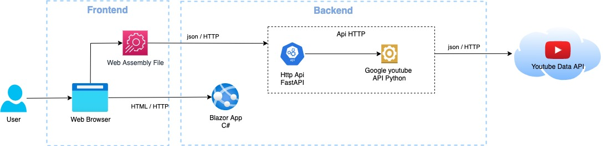
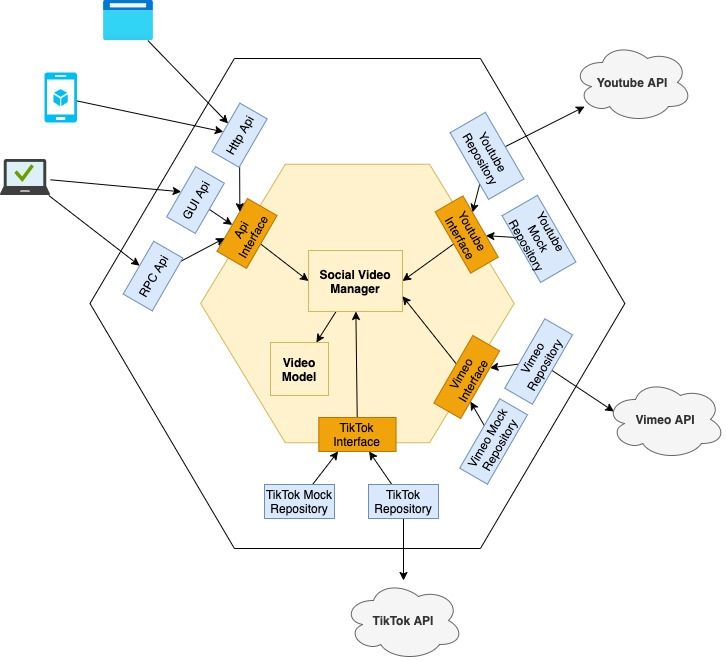

# Makrwatch 


## Coding Challenge - Senior Backend Software Engineer

Build a web application to search and display all the YouTube videos that match certain filters.

# Software Architecture Diagrams

## Reference Architecture



## Backend Architecture



# Installation

The application is divided into two parts - Frontend and Backend. The Frontend is written in Blazor and .NET Core 6 and the Backend is written in Python using FastAPI framework.

**Requirements**

* [Python 3.6+](https://www.python.org/downloads/)
* [.NET Core 6](https://dotnet.microsoft.com/en-us/download/dotnet/6.0)

Clone the repo

```bash
git clone https://github.com/dloperab/makrwatch.git
```

## Run the Backend

Create a new python environment

```bash
python -m venv env
```

Activate your environment

```bash
source venv/bin/activate # Linux and MAC

env\Scripts\activate # Windows
```

Install the requirements for this project

```bash
pip install -r backend\requirements.txt
```

Create a **.env** file in the **/backend** folder and add this line to it

```bash
YOUTUBE_API_KEY=<YOUR_API_KEY>
```

where <YOUR_API_KEY> is the credentials key from Google to use the Youtube Data API

Run the project

```bash
python backend\src\main.py
```

You can consume the API using Swagger in

```bash
http://localhost:8080/docs
```

## Test the Backend

```bash
cd .\backend\

pytest -v
```

## Run the Frontend

Navigate to the project

```bash
cd .\frontend\MakrwatchClient
```

Restore the project

```bash
dotnet restore
```
Run the project

```bash
dotnet run
```

Wait for the app to display that it's listening on **localhost:port-number** and for the browser to launch at that address

# Video debrief presentation 

* [Youtube Video](https://www.youtube.com/watch?v=RPgkHRI8o90)
* [Presentation](docs/presentation/video_debrief_presentation.pdf)
